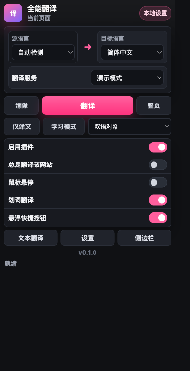
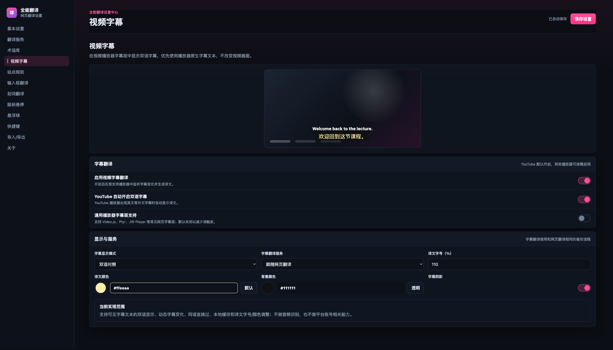
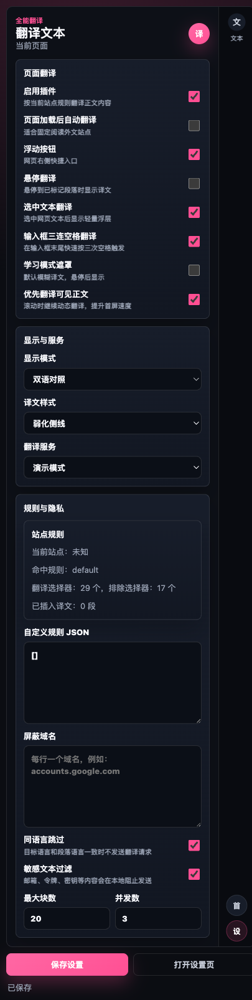
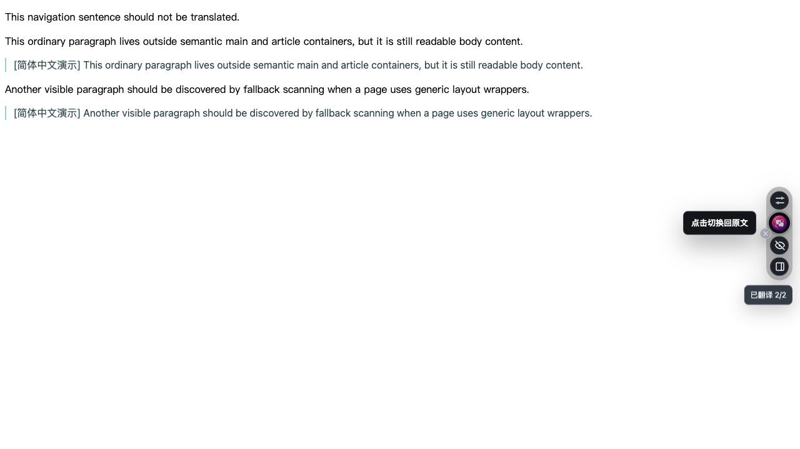
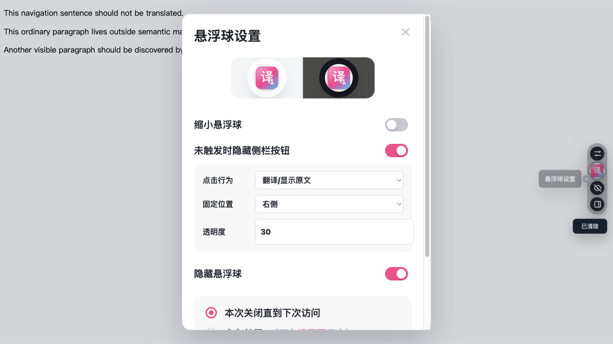

# 全能翻译

全能翻译是一个独立的 Chrome Manifest V3 网页翻译插件，目标是提供低侵入的双语阅读、划词翻译、悬停翻译、输入框翻译、视频字幕翻译、站点规则和可配置翻译引擎。

> 当前项目为浏览器插件，不依赖任何外部前端项目代码。源码位于 `all-in-one-translate-extension/`。

## 最新版本

- 当前版本：`v0.1.2`
- 下载地址：[GitHub Releases](https://github.com/bianningtao/quanneng-fanyi/releases/latest)
- 最新安装包：`quanneng-fanyi-v0.1.2.zip`
- 问题反馈：如果遇到漏翻、误翻、页面错位或功能异常，请到 [Issues](https://github.com/bianningtao/quanneng-fanyi/issues) 提交页面地址、截图和复现步骤。

## 截图

### 弹窗



### 设置中心



### 侧边栏



### 悬浮球



### 悬浮球设置



## 功能

- 网页段落级双语翻译：支持双语对照、仅译文、仅原文悬停、替换原文、仅悬停等显示方式。
- 动态网页翻译：支持 SPA、长文档、滚动加载、弹窗、菜单、标签页、下拉项、按钮、表单 placeholder 和常见文档站导航区域的持续翻译。
- 翻译状态保持：同一网站开启翻译后，刷新页面、进入子路径、打开弹窗或切换局部标签时，会继续保持翻译状态；取消翻译后恢复原文。
- 翻译样式：支持弱化侧线、下划线、波浪线、引用线、高亮、背景、阴影、模糊学习模式、自定义字号、宽度、字体和颜色板选色。
- 翻译引擎：内置 Google 网页翻译、Microsoft 翻译接口、自定义 JSON API、OpenAI-compatible `/chat/completions` API 和演示模式。
- 备份流程：可自定义翻译服务顺序，前一个服务失败后自动尝试下一个可用服务。
- 站点规则：内置 GitHub、X/Twitter、Reddit、StackOverflow、Medium、YouTube 等常见网站规则，支持在设置页可视化新增、编辑和同步高级 JSON 规则。
- 术语库：内置多组常用术语库，也支持用户自定义术语和按域名生效；自定义 API 会收到术语约束，Google/Microsoft 等服务会在请求前保护匹配术语。
- 划词翻译：选中文本后显示轻量浮层翻译。
- 鼠标悬停翻译：悬停到文本片段时显示译文。
- 输入框翻译：在输入框中快速触发翻译，适合写回复、评论和消息。
- 视频字幕翻译：监听可见字幕文本，支持双语字幕或仅译文字幕，并可配置字号、颜色、背景和阴影。
- 字幕抓取与下载：支持从 YouTube 和常见网页播放器尝试抓取当前页面字幕轨道，可选择下载原文、译文或双语字幕。
- 文件/字幕文件翻译：侧边栏支持 `.txt`、`.md`、`.srt`、`.vtt` 文件翻译；字幕文件会保留时间轴，并可分别导出译文字幕和双语字幕。
- 悬浮球：页面右侧快捷入口，支持隐藏、缩小、透明度、固定位置和点击行为设置。
- Chrome 侧边栏：提供文本翻译、网页翻译、站点规则、服务设置等快捷操作。
- 快捷键和右键菜单：支持页面翻译、整页翻译、侧边栏、输入框翻译、划词翻译等操作。

## 安装使用

当前可以通过 GitHub Release 下载 zip，也可以直接从源码目录加载。

### 从 Release 安装

1. 打开 [Latest Release](https://github.com/bianningtao/quanneng-fanyi/releases/latest)。
2. 下载最新版本中的 `quanneng-fanyi-v0.1.2.zip`。
3. 解压 zip 文件。
4. 打开 Chrome，进入 `chrome://extensions/`。
5. 打开右上角“开发者模式”。
6. 点击“加载已解压的扩展程序”。
7. 选择解压后的 `all-in-one-translate-extension/` 文件夹。
8. 浏览器工具栏会出现“全能翻译”图标。

### 从源码安装

1. 下载或克隆本仓库。
2. 打开 Chrome，进入 `chrome://extensions/`。
3. 打开右上角“开发者模式”。
4. 点击“加载已解压的扩展程序”。
5. 选择本仓库中的 `all-in-one-translate-extension/` 文件夹。
6. 浏览器工具栏会出现“全能翻译”图标。

### 更新已有安装

1. 下载新版 zip 并解压。
2. 打开 `chrome://extensions/`。
3. 找到“全能翻译”。
4. 如果之前是从源码目录加载，直接将扩展目录替换为新版 `all-in-one-translate-extension/`，然后点击“重新加载”。
5. 如果之前加载的是旧解压目录，可以删除旧扩展后重新选择新版目录。

## 基本教程

### 翻译网页

1. 打开任意外文网页。
2. 点击页面右侧悬浮球的翻译按钮，或点击浏览器工具栏中的插件图标。
3. 插件会优先翻译可见内容，滚动页面、打开弹窗、切换局部标签或进入同站子页面时继续处理新出现的文本。
4. 再次点击翻译按钮可以切回原文。

### 设置翻译服务

1. 打开插件设置页。
2. 进入“翻译服务”。
3. 选择默认服务，或添加自定义 OpenAI-compatible 接口。
4. 在“翻译备份流程”里按行调整服务顺序。
5. 点击“测试服务”确认当前服务可用。

### 调整译文样式

1. 打开设置页的“基本设置”。
2. 选择“显示模式”和“译文显示样式”。
3. 如需自定义颜色，使用颜色板选择；选择后会显示色块和十六进制值。
4. 调整字体缩放、最大宽度和字体族。

### 配置字幕翻译

1. 打开设置页的“视频字幕”。
2. 启用视频字幕翻译。
3. 选择字幕显示模式、翻译服务、字号、颜色、背景和阴影。
4. 在 YouTube 或常见 HTML5 播放器页面播放带字幕的视频。

### 抓取并下载网页字幕

1. 打开带字幕的视频页面，例如 YouTube 或提供字幕轨道的网页播放器。
2. 打开插件侧边栏，进入“文件/媒体”。
3. 点击“抓取当前页面字幕”。
4. 识别成功后可预览源字幕和译文。
5. 按需要下载原文字幕、译文字幕或双语字幕。

> 如果视频本身没有字幕轨道，当前版本不会自动进行音频识别。音频识别和无字幕视频的自动转写会在后续阶段评估。

### 翻译文件和字幕

1. 打开 Chrome 侧边栏中的“文件/媒体”。
2. 拖拽或选择 `.txt`、`.md`、`.srt`、`.vtt` 文件。
3. 点击“翻译文件”，插件会按分段复用当前翻译服务和备份流程。
4. 普通文本可下载译文；字幕文件可下载保留时间轴的译文字幕或双语字幕。

> PDF 文本层、扫描版 PDF、图片 OCR 和音频识别不在 `v0.1.2` 的稳定能力范围内；当前文件入口不会默认上传图片或音频。

### 添加术语

1. 打开设置页的“术语库”。
2. 启用内置术语库，例如科技、Web3、编程、金融、法律等。
3. 在自定义术语中添加 JSON 规则，可按域名限定生效范围。

### 配置站点规则

1. 打开设置页的“站点规则”。
2. 使用“新增规则”填写域名、正文选择器、排除选择器和保持原文选择器。
3. 动态页面可选择“自动判断”或“积极适配”，用于 X/Twitter、Reddit 等持续加载内容的网站。
4. 高级用户仍可直接编辑 JSON；保存时会保留未可视化字段。

## 自定义 API

普通 JSON API 请求格式：

```json
{
  "text": "Hello",
  "sourceLanguage": "auto",
  "targetLanguage": "zh-CN",
  "glossary": [
    { "source": "LLM", "target": "大语言模型", "note": "", "domains": [] }
  ]
}
```

可接受响应：

```json
{ "text": "你好" }
```

也兼容 `translatedText`、`translation`、`result`、`data.text`、`data.translatedText`、`data.translation`。

OpenAI-compatible 引擎可配置 `/chat/completions` 地址，插件会发送 `model`、`temperature`、`messages`、术语约束和提示词。

## 隐私说明

- 同步设置保存在 `chrome.storage.sync`。
- API Key、自定义引擎密钥、自定义术语保存在 `chrome.storage.local`。
- 导出设置不会包含本地密钥。
- 默认 Google 网页翻译会向 Google 翻译接口发送待翻译文本；自定义接口会向用户配置的服务发送待翻译文本。

## v0.1.2 更新重点

- 增强动态页面和文档站翻译覆盖率，减少长页面滚动后的漏翻。
- 改进包含内联代码的标题、段落、文档目录、反馈按钮和上一页/下一页导航翻译。
- 改进 X/Twitter 中文内容检测，减少中文帖子被重复翻译为中文。
- 支持从 YouTube/网页播放器尝试抓取字幕，并导出原文、译文或双语字幕。
- 优化弹窗、表单、下拉菜单、输入框 placeholder 的翻译扫描。
- 保持同站点翻译状态，减少刷新、切换子页面和打开弹窗后的状态丢失。

## 已知边界

- 无字幕视频不会自动转写音频。
- 图片 OCR、扫描版 PDF OCR 仍属于后续规划。
- 不同网站 DOM 结构差异较大，若遇到漏翻或页面错位，请提交 Issue 并附上页面地址与截图。

## 项目结构

```text
.
├── docs/screenshots/              # README 截图
├── scripts/                       # 图标生成和打包脚本
├── all-in-one-translate-extension/ # Chrome 插件源码
│   ├── manifest.json
│   ├── background.js
│   ├── content-core.js
│   ├── content-script.js
│   ├── options.html
│   ├── popup.html
│   └── sidepanel.html
```

本地开发记录和验证脚本保存在工作区的 `process/`、`tests/` 目录中，这两个目录默认不提交到远端。

## 打包发布

```bash
scripts/generate-icons.sh
scripts/package-extension.sh
```

打包产物会生成到 `dist/`：

- `quanneng-fanyi-v0.1.2.zip`
- `quanneng-fanyi-v0.1.2.zip.sha256`

发布到 GitHub Release 时，将 zip 和 sha256 文件作为附件上传即可。

### Release 规则

- 每次更新 Release 都必须新建一个版本号和对应 tag，例如从 `v0.1.1` 升到 `v0.1.2`。
- 新版本发布后需要标注为 GitHub 最新版，也就是非 draft、非 prerelease 的 Latest release。
- 旧版本 Release 和附件必须保留，不删除、不覆盖，方便回退和历史下载。
